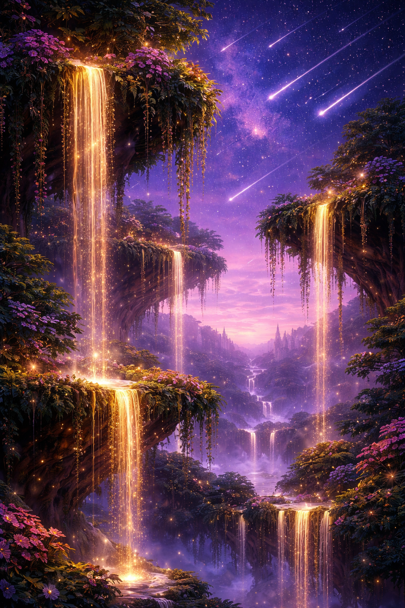
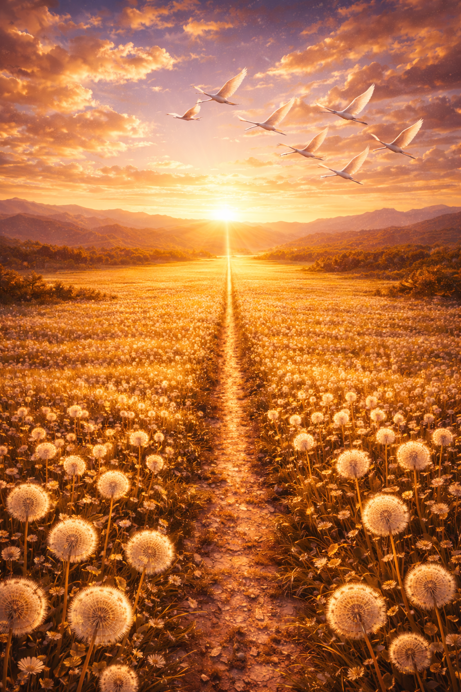

# Objective: Create prompts for models that generate images.

## Write a descriptive prompt for an image model (e.g., "A futuristic city skyline at sunset in watercolor style.").

    Prompt: 
        Generate an image model with lush hanging gardens, filled with golden waterfalls, and a purple skyline overlaid with shooting stars.

    Output

        

## Refine the prompt by adding constraints such as art style, colors, or perspective.

    Prompt: 
        Generate an image model of aerial perspective of golden Elysian fields filled with dandelions, a straight dirt path in one-point perspective leading to a bright vanishing point at the sunset horizon. Velvety golden sky with soft clouds and a flock of white egrets flying in the sky toward the light. Ethereal atmosphere, cinematic lighting, volumetric sun rays, fantasy realism, ultra-detailed, 8k digital painting.

    Output
        

## Compare results between a vague prompt and a refined descriptive prompt.

    The vague prompt produces a more creative but less controlled image because it gives only general ideas without specifying perspective, composition, or lighting. The model decides these details on its own, which can lead to beautiful but unpredictable results. The image may lack clear depth, focal points, or precise structure.

    The refined prompt produces a more structured and accurate image because it clearly defines perspective, vanishing point, lighting, and element placement. This helps the model create strong depth, realistic atmosphere, and correct positioning of elements like the path and egrets. As a result, the output is more cinematic, coherent, and closely matches the intended vision.
